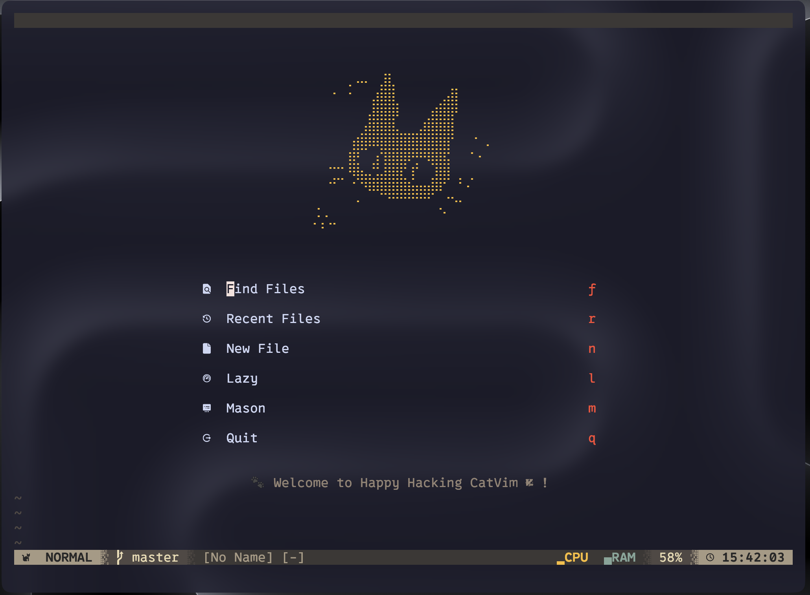

# 个人终端与编辑器配置指南 (Dotfiles)

本仓库包含了用于构建高效、美观且集成了强大 AI 辅助功能的现代化终端开发环境的配置文件。核心配置围绕 Neovim (命名为 CatVim)、Kitty 终端模拟器、Zsh 提示符 (Powerlevel10k) 以及 Yazi 终端文件管理器展开。

## 核心特点

* 全局极简与透明化美学：Kitty 与 Neovim 均配置了透明背景与毛玻璃效果，配合 Gruvbox 与 Catppuccin 混搭色彩风格，提供沉浸式编码体验。
* 深度的 AI 编码辅助：Neovim 深度集成 Kimi 大模型 (基于 Moonshot API)，支持内联代码生成、多轮对话、代码解释、自动生成 Commit 提交信息等。
* 全功能的 LSP 与语法支持：开箱即用的 Python、C/C++、Lua、JavaScript/TypeScript 以及 LaTeX 支持。
* 终端工具链整合：Yazi 文件管理器与 Neovim 无缝联动，使用 Neovim 作为默认文本预览器与编辑器。
* 系统级性能监控：Neovim 状态栏内置了针对 macOS 优化的实时 CPU 与内存压力监控。

## 模块详细说明

### 1. Neovim (CatVim) 配置

本 Neovim 配置基于 `lazy.nvim` 插件管理器构建，注重启动速度与模块化管理。

#### 视觉与 UI

* 主题色彩：全局使用 `gruvbox` 主题，并强制开启了背景透明化（包括 Normal、SignColumn、VertSplit 和状态栏区域）。
* 启动界面：使用 `alpha-nvim`，配置了自定义的 ASCII Art 启动图案与快捷操作菜单。
* 状态栏 (Lualine)：定制化的 Gruvbox 主题状态栏，右侧集成了自定义的 Lua 脚本，通过调用 macOS 的 `ps` 和 `memory_pressure` 命令实时显示 CPU 与 RAM 使用率指示条。
* 顶部标签页：使用 `bufferline.nvim`，集成文件浏览器图标，支持快速切换与关闭缓冲。

#### AI 辅助编程 (llm.nvim)

集成了 `kimi-k2-thinking-turbo` 模型（需配置 `LLM_KEY` 环境变量），提供以下快捷功能：

* `<leader>ac`：切换 Kimi 侧边栏对话会话。
* `<leader>ak`：唤起悬浮窗向 Kimi 提问。
* `<leader>ts` / `<leader>at`：选中文本进行中英互译。
* `<leader>ae`：解释选中的代码片段。
* `<leader>tc`：为选中代码自动生成测试用例。
* `<leader>ao`：对选中的代码进行优化，并展示 Diff 对比。
* `<leader>ag`：读取 `git diff` 并自动按照 Conventional Commits 规范生成 Git 提交信息。
* `<leader>ad`：为代码自动生成文档注释 (Docstring)。

#### 开发与补全体验

* 代码补全：基于 `nvim-cmp`，集成 LSP、缓冲区、路径及 `luasnip` 代码片段补全。
* LSP & 工具链：使用 `mason.nvim` 和 `mason-lspconfig` 自动管理语言服务器（如 clangd, pyright, lua_ls, texlab 等）。
* 代码格式化与诊断：通过 `none-ls` 接入 `stylua`, `black`, `flake8`, `shellcheck` 等外部工具。
* Git 集成：使用 `vim-fugitive` 处理常规 Git 操作，通过 `mini.diff` 在侧边栏提供实时 Diff 差异显示及 hunk 操作（支持撤销、应用差异）。
* Markdown 与 LaTeX：支持 Markdown 实时渲染 (`render-markdown.nvim`)；集成 `vimtex`，默认使用 `latexmk` 编译和 `zathura` 预览 PDF。

#### 核心快捷键 (Keymaps)

* 窗口操作：`\` 横向分割，`|` 纵向分割；`<C-h/j/k/l>` 在窗口间移动；`+` 和 `=` 调整窗口大小。
* 快速搜索：`<leader>ff` (查找文件), `<leader>fg` (全局搜索), `<leader>fb` (查找 Buffer)。
* 文件树：`<leader>e` 切换左侧 Neo-tree 侧边栏。
* 终端管理：`<Space>th` / `<Space>tv` 快速打开水平或垂直分割的内置终端。
* 文本搜索替换：`<leader>sf` (使用 SearchBox 进行可视化搜索), `<leader>sr` (搜索并替换)。

### 2. Kitty 终端模拟器

配置文件：`kitty.conf`

* 字体配置：使用 `0xProto Nerd Font Mono`，字号设为 16，禁用连字效果（光标处）。
* 视觉效果：启用 `Catppuccin-Mocha` 颜色主题。
* 窗口透明：开启动态背景透明 (`dynamic_background_opacity yes`)，透明度设为 0.82，背景模糊度设为 30。
* 窗口布局：隐藏原生标题栏，设置 15px 内边距，使用顶部 Powerline 圆角风格标签页。
* 光标交互：启用光标拖影效果 (`cursor_trail`)，提升视觉流畅度。

### 3. Zsh 提示符 (Powerlevel10k)

配置文件：`.p10k.zsh`

* 显示模式：采用双行显示，首行展示详细信息，次行为输入提示符。
* 状态展示：左侧显示 macOS 图标、当前路径（智能缩略）、详细的 Git 状态（分支、未追踪文件、修改行数）。右侧集成命令执行时间、后台任务以及版本管理工具状态。
* 瞬态提示符 (Transient Prompt)：开启瞬态提示符功能，执行完命令后自动精简历史提示符，保持终端界面整洁。

### 4. Yazi 文件管理器

配置文件：位于 `yazi/` 目录

* 色彩主题：全面应用 `Gruvbox` 主题，包含定制的 `theme.toml` 以及基于 `.tmTheme` 格式的语法高亮配置文件，确保在预览代码时拥有与 Neovim 一致的色彩体验。
* 文件预览器关联 (`yazi.toml`)：将 Neovim 配置为默认的代码及文本预览器。所有 `.cpp`, `.py` 以及 `text/*` 文件在打开或预览时，均会以 Headless 模式或直接调用 Neovim 渲染。

## 安装与环境依赖

为了确保所有配置项能够正常运行，您的系统需要安装以下依赖：

### 系统基础依赖

1. 字体：请安装 [0xProto Nerd Font](https://github.com/ryanoasis/nerd-fonts)。
2. 工具链：Git, curl, Node.js (供部分 LSP 使用), Python3 & pip, Ripgrep, fd。
3. 编译器：GCC/Clang (用于编译 Treesitter 模块和 C++ 代码)。

### 核心软件版本建议

* Neovim：>= 0.9.0 (建议 0.10.0+)
* Kitty：最新版本 (以支持 `cursor_trail` 功能)
* Zsh：配合 Oh My Zsh 以及 Powerlevel10k 主题
* Yazi：最新稳定版

### 特定功能依赖

* LaTeX 环境：需安装 `texlive` 或 `mactex`，并在系统中配置 `latexmk` 与 `zathura` 查看器。
* AI 环境变量：需在 Shell 配置文件中 (如 `.zshrc`) 导出 Moonshot API 密钥：
`export LLM_KEY="your_moonshot_api_key_here"`

## 特别说明

1. macOS 专属优化：Neovim 状态栏中的内存监测脚本调用了 `memory_pressure` 命令，该命令为 macOS 特有。如果您在 Linux 系统上运行，请修改 `nvim/lua/plugins/lualine.lua` 中的 `memory_bar` 函数，将其替换为读取 `/proc/meminfo` 或调用 `free` 命令的实现。
2. 性能看板：本配置已针对搭载 8 核心芯片的 macOS 设备进行过测试与调优。
3. 多版本管理：本配置有fedora与arch分支。
4. 本README文件部分AI生成。
